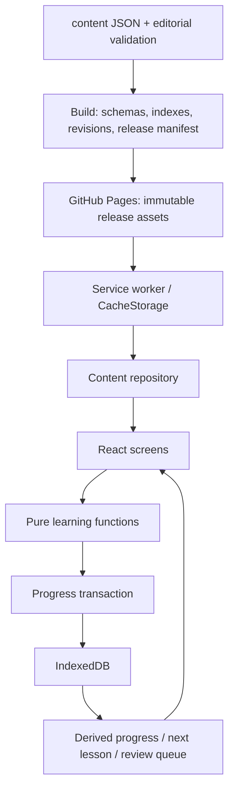

# Архитектура и технические решения

Статус: принято для будущей реализации. Основание — [продукт](../../PRODUCT.md), подготовленный корпус и ограничения статического хостинга. Ни один описанный ниже модуль ещё не реализован.

## Выбранный стек

| Область | Решение | Причина и граница |
|---|---|---|
| Язык | TypeScript, strict, noUncheckedIndexedAccess | Явные варианты вопросов и состояний; входной JSON всё равно проверяется в runtime |
| UI | React, функциональные компоненты | Сложность находится в переходах состояния, формах и доступности; компоненты переиспользуют одни предметные правила |
| Сборка | Vite, npm, один lockfile | Статический dist; нет SSR, server actions и сервера в production |
| Маршруты | React Router, декларативный HashRouter | URL после `#` не требует переписывания путей на Pages |
| CSS | CSS Modules для компонентов, один слой токенов и базовой типографики | Без второго дизайн-языка и крупного UI-framework; нативные HTML controls там, где достаточно |
| Хранилище | IndexedDB через `idb` | Транзакции, индексы, версии; одна небольшая обёртка вместо собственного promise API |
| PWA | vite-plugin-pwa, `injectManifest`, Workbox precaching | Собственный короткий контракт активации; не автоматический reload во время ответа |
| Валидация | JSON Schema + Ajv для импорта и пакетов; типы предметной модели отдельно | Схемы являются границей недоверенных данных, не генератором архитектуры |
| Проверки | Vitest, Testing Library; Playwright; axe-core | Чистая логика, пользовательские действия и реальные браузерные сценарии имеют разные уровни |
| Иконки | Небольшой явно импортируемый набор Lucide | Единая геометрия, подписи обязательны; шрифт иконок не нужен |
| Движение | CSS transitions; Web Animations API только для прерываемого закрытия панели при необходимости | Без GSAP, motion-библиотеки или пружинного движка в первом выпуске |

Версии: при начале этапа D1 разработчик выбирает совместимые **стабильные** выпуски, фиксирует точные версии direct dependencies и lockfile, а также точный поддерживаемый Node LTS в CI и локальной конфигурации. Номера patch не копируются из этого документа на месяцы вперёд. Major-обновления проходят отдельный PR с проверкой миграций, сборки и PWA. Не использовать floating `latest`, экспериментальные React/RSC API или CDN-импорты в выпуске.

Vite требует корректного `base` для проекта на Pages; hash-адрес не отправляется серверу. Эти свойства подтверждены [Vite](https://vite.dev/guide/static-deploy) и [React Router](https://reactrouter.com/api/declarative-routers/HashRouter). Подробности регистрации worker — в [PWA](08-pwa-platforms.md).

## Границы модулей

Предлагаемая структура ниже — схема будущих исходников, не созданные каталоги приложения.

| Будущий модуль | Владеет | Не делает |
|---|---|---|
| `app` | bootstrap, router, providers, shell, recovery boundary | Не проверяет учебные ответы |
| `domain/content` | Типы и адаптер исходного корпуса; каталог по ID, ограничения eligibility | Не хранит пользовательский прогресс |
| `domain/learning` | Чистые функции grading, mastery, route recommendations, exposure, review scheduling | Не импортирует React, DOM, IndexedDB, Date.now или fetch напрямую |
| `data/content` | Загрузка совместимого неизменяемого пакета, проверка hash, индексы поиска | Не изменяет исходные формы и ключи |
| `data/progress` | Репозиторий транзакций, миграции, export/import, согласование вкладок | Не определяет правильность ответа |
| `features/lessons`, `practice`, `review`, `reader`, `dictionary`, `reference`, `settings` | Экраны и небольшие локальные reducers | Не читают IndexedDB напрямую и не дублируют grading |
| `ui` | Кнопка, поле, dialog, navigation, ArabicText, feedback, table | Не знает, что вопрос V08 означает |
| `pwa` | Регистрация и worker, уведомление о готовой версии, cache policy | Не читает ответы и не выполняет SRS в фоне |
| `styles` | Токены, темы, шрифты, reset, ограниченные utilities | Не содержит layout отдельного урока |

Зависимость идёт от UI к domain/data через короткие функции. Одного `progressRepository` и `contentRepository` достаточно; интерфейс для каждого класса, DI-контейнер, event bus, микрофронтенды, глобальная Redux-модель и универсальный CMS-движок не нужны. Модуль выделяется по реальному владельцу поведения. Сходные строки не обязательно являются одним компонентом: карточка слова и ответ с radio имеют разную семантику.

## Владение состоянием

- **URL**: адрес раздела, урока, текста, выбранного правила, поисковая строка, фильтр, открытая словарная панель. Не ответы, оценки, ключи или персональные данные.
- **Компонент/reducer сессии**: ввод до отправки, выбранные варианты, состояние поля/панели. Это не второй источник сохранённого результата.
- **IndexedDB**: подтверждённые ответы, черновики, сессии, настройки, экспозиция подсказок, закладки и расписание. После commit UI принимает новую revision.
- **Неизменяемый контент в памяти**: каталог текущего release; доступ по ID. Большие текстовые ресурсы загружаются по разделам, офлайн-cache может уже содержать все.
- **Вычисляемые представления**: проценты, следующий урок, число due, статус карточки. Их не редактируют отдельными setters. При необходимости materialized summary обновляется в одной транзакции с событием и может быть пересобран.

Связанные переходы задаются единственным enum состояния, а не несовместимыми `isAnswered/isLoading/isSuccess`. Это соответствует принципам [React о структуре state](https://react.dev/learn/choosing-the-state-structure). Использовать reducer для сессии; `useState` для простой панели. Effects синхронизируют с внешним миром, не выполняют grading повторно при ререндере. Отправка идёт из пользовательского события, имеет idempotency key и выдерживает StrictMode.

## Запуск приложения

1. Минимальный HTML задаёт язык, тему по сохранённому безопасному предпочтению, fallback при отключённом JavaScript и ссылку на описание проекта. Курс интерактивен и требует JavaScript; это честно указано по-татарски.
2. Загружаются shell, основной CSS, кириллический шрифт. Определяется поддержка IndexedDB/worker; доступность этих API проверяется реальной операцией, не только наличием свойства.
3. Открывается БД, выполняются совместимые миграции. `blocked` ведёт к экрану закрытия другой вкладки; сбой не вызывает удаления базы. При недоступном постоянном хранилище загрузка курса продолжается в режиме без сохранения: читать и выполнять задания в памяти можно, а ограничение и экспорт текущей сессии видимы.
4. Загружается release manifest встроенной версии приложения; проверяются совместимость и каталог. Нет данных — экран загрузки/повтора; есть сохранённый release — можно работать с ним.
5. Восстанавливается сессия или запрошенный deep link. Onboarding показывается по необходимости, не перехватывает навсегда ссылку на справочник.
6. Worker регистрируется с project scope. Готовность всего офлайн-пакета подтверждается отдельно. Запуск урока не зависит от предложения установки.

## Сборка содержимого

Исходный `content/manifest.json` остаётся редакционным манифестом. Сборка приложения создаёт рядом **release manifest** со следующими полями: `release_id`, `app_version`, `content_version`, `content_schema`, `progress_schema`, `min_reader_version`, `base_path`, `built_at`, `assets[{url,sha256,bytes,kind,required}]`, `question_revisions`, `policy_versions`. Это разные манифесты: шрифты, CSS и JS отсутствуют в исходном редакционном файле.

Пайплайн: строгая редакционная проверка → проверка JSON Schema → формирование runtime catalog и индексов → вычисление revisions → сборка UI → список всех обязательных assets с хешами → список precache оболочки и пакет курса → проверка dist по manifest. Worker автоматически сохраняет небольшую оболочку; полный курс со всеми обязательными шрифтами и JSON загружается по действию «Интернетсыз уку өчен сакларга». Факт установки worker не означает готовность полного курса. Новый полный пакет активируется согласованно по правилам PWA, а не по мере получения отдельных JSON. В runtime попадают только ресурсы allowlist. Из `sources/` в allowlist входит только обязательный `sources/sections.json` — индекс источниковых разделов со стабильными ID. Остальные исходники, исходный DOC, аудиты и инструменты не копируются в dist. Архивные записи могут присутствовать в исходном JSON пакета, но адаптер исключает их из любого пользовательского каталога и тренировок; не обещать секретность JSON или ключей.

Runtime adapter сохраняет ссылку на исходный ID и профиль. Если добавляет `grading_revision`, `content_fingerprint` или технический word ID, это вычисленные служебные поля; он не меняет `display_form` и `accepted_answers`. Подробный контракт — [данные](02-data-contracts.md).

## Архитектурные решения и альтернативы

| ADR | Решение | Почему отклонена альтернатива | Когда пересмотреть |
|---|---|---|---|
| A01 | Статический SPA | SSR/backend не нужны локальному курсу и несовместимы с одним Pages | Появится явно заказанная серверная функция |
| A02 | Hash routes | History fallback через 404 добавляет ненадёжный redirect | Смена хостинга с управляемыми rewrites |
| A03 | Локальный прогресс | Аккаунты усложняют приватность и офлайн | Владелец утвердит синхронизацию и её бюджет |
| A04 | Собственные небольшие компоненты | Большой kit диктует излишний стиль и не решает арабицу | Повторяющийся сложный control оправдает отдельную библиотеку |
| A05 | Фиксированное объяснимое расписание | FSRS/SM-2 требуют отдельной модели и калибровки | Пилот покажет потребность и даст данные |
| A06 | Версия контента связана с release приложения | Горячая замена ключей посреди сессии создаёт неоднозначные результаты | Появятся проверенные независимые compatibility rules |
| A07 | Нативная прокрутка и текст | Canvas/постраничный flipbook мешают выделению и доступности | Отдельный режим факсимиле, не замена курса |
| A08 | Полный self-host шрифтов | CDN ломает автономность и добавляет внешние запросы | Не пересматривать без существенной причины |

## Контракты ошибок

`content_unavailable`, `content_corrupt`, `unsupported_release`, `storage_unavailable`, `storage_full`, `storage_blocked`, `write_conflict`, `import_invalid`, `update_failed` — различимые коды на границах data. UI сопоставляет их татарским сообщениям, сохраняет контекст и даёт конкретное действие. Не показывать stack trace пользователю. Непредвиденный сбой одного экрана ловится route boundary; settings/export доступны из recovery shell, если БД ещё читается. Глобальный сбой не должен выполнять автоматический reset.

Для долгих fetch отмена через AbortController и игнорирование устаревшего request ID. Индексация корпуса данного размера начинается синхронной чистой функцией; Web Worker добавляется только при измеренном превышении бюджета, а не заранее. Отсутствие сети не считается ошибкой ответа.

## Условия готовности архитектуры к разработке

Разработчик может выделить предметные функции без UI, создать схемы на реальных JSON, определить границы транзакций и собрать статический artifact под `/isketatar/`. Все глобальные числа и состояния берутся из соседних контрактов; выбор технологий не разрешает менять методику. Критические интеграционные проверки и этапы реализации перечислены в [качестве](10-quality-release.md) и [дорожной карте](11-development-roadmap.md).

Референсы API: [IndexedDB](https://developer.mozilla.org/en-US/docs/Web/API/IndexedDB_API/Using_IndexedDB), [idb](https://github.com/jakearchibald/idb), [injectManifest](https://vite-pwa-org.netlify.app/guide/inject-manifest), [Workbox precaching](https://developer.chrome.com/docs/workbox/modules/workbox-precaching). Проверено 12.09.2026; эти ссылки описывают инструменты, а схема выше — решение проекта.

Проверка этапа проектирования: строгий валидатор исходного корпуса 12.09.2026 завершился с 0 ошибками; независимый просмотр архитектуры выявил и устранил исключение для `sources/sections.json` и отсутствие явной ветки чтения без IndexedDB. Сборка приложения не выполнялась: её исходников ещё нет.
