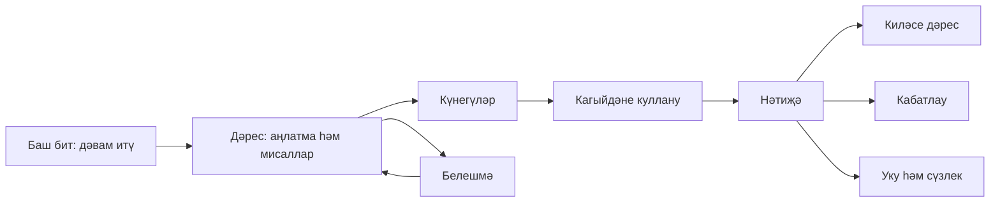

# Экраны и пользовательские сценарии

Спецификация UI/UX первого полного выпуска. Адреса, параметры и история принадлежат [маршрутизации](05-routing.md), расчёты — [механикам](03-learning-mechanics.md), внешний вид — [дизайн-системе](04-design-system.md). Этот документ описывает состав экранов и реакцию на действия; макет или приложение не создавались.

## Общие правила экранов

В оболочке пять разделов: «Дәресләр», «Кабатлау», «Уку», «Сүзлек», «Белешмә». Название «Иске имля» ведёт на главную, настройки доступны отдельным подписанным действием. Смысл и порядок основных разделов одинаковы при любой ширине. Страницы используют обычные ссылки; Ctrl/Cmd-click, открытие новой вкладки и браузерное «Назад» сохраняются.

Три шаблона: **каталог** (общий контейнер до 1280px), **документ** (колонка до 680px с возможной соседней справкой), **сеанс** (вопрос и ответы до 640px). На экране сеанса полная навигация свёрнута, чтобы не создавать две нижние полосы; остаются заголовок, счётчик и «Саклап чыгу». Через выход доступны все разделы. Выход не требует подтверждения при успешно сохранённом черновике. При несохранённом состоянии показывается реальное последствие и доступен экспорт.

Широкая колонка справки появляется только по действию пользователя. На узком/среднем окне та же сущность открывается модальным диалогом в пределах viewport. Нельзя одновременно показывать две модальные панели. Ссылка из панели на полноценную статью открывает отдельную страницу; «Назад» возвращает к панели и её слову.

Пять нижних пунктов используются при 360–639CSSpx; ниже 360 — меню в шапке; среднее окно 640–1119 имеет отдельную строку навигации; от 1120 — строку в шапке. Низкая высота окна, большой текст и клавиатура переводят закреплённые действия в обычный поток, если иначе нельзя сохранить видимый фокус. Контент не обрезается ради фиксированного макета.

Иллюстративная структура основного занятия:

## S00. Запуск и восстановление

Первый видимый shell содержит название, понятный статус загрузки и каркас будущего основного блока. Не показывать фиктивные арабские буквы или случайный нулевой прогресс. После готовности каталога и чтения состояния открывается запрошенный адрес либо главная.

| Состояние | Что видит пользователь | Действие |
|---|---|---|
| Первая загрузка | «Материаллар йөкләнә…» | Можно дождаться; при ошибке повторить |
| Нет сети и нет сохранённого пакета | Причина недоступности курса | Подключиться и повторить, открыть доступные настройки |
| Контент доступен, прогресс недоступен | Курс и постоянная отметка несохранённости | Учиться в памяти, экспортировать текущую работу |
| Другая вкладка блокирует миграцию | Что требуется закрыть/обновить | Повтор открытия; данные не сбрасываются |
| Прежний сеанс совместим | Название занятия и текущий шаг | Продолжить либо остаться на запрошенной странице |
| Прежний сеанс несовместим | Черновик сохранён как история старой версии | Экспорт, новый сеанс; без подмены ключа |
| Не загрузился Noto | Татарская причина вместо оцениваемого стимула | Повторить, скачать пакет; теория кириллицей доступна |

Установлена ли PWA, готов ли офлайн-пакет и сохранён ли последний ответ — разные показатели. Начало курса не ждёт установки приложения.

## S01. Выбор пути

Один экран, без карусели из рекламных слайдов. Название, краткая татарская формулировка аудитории, две radio-карточки уровня арабской графики, пояснение каждой и действие начала. Диагностика предлагается отдельным действием. Нельзя заставлять умеющего читать арабицу пройти семь вводных уроков ради активации приложения.

До выбора основной CTA требует выбрать вариант и объясняет это рядом с группой. После выбора путь сохраняется, затем выполняется сохранённое намерение deep link или открывается первый урок. При ошибке записи выбор действует в памяти с заметным статусом. Переключение пути позже не требует повторного onboarding и не стирает результаты.

## S02. Главная

Основной блок — **одно** продолжение: название занятия, его состояние, номер текущего вопроса/раздела и «Дәвам итәргә». Если начатого занятия нет, предлагается первый нужный урок текущего пути. Ниже — число назначенных повторов и переход к чтению. Ссылка «Барлык дәресләр» открывает всю программу.

Прогресс показан текстом: сколько уроков проработано из обязательных выбранного пути; рядом отдельно самостоятельная проверка. Тонкая полоса лишь дублирует числа. Она не называется уровнем знания татарского. Нулевой прогресс естественен для нового пользователя; нет пустых графиков, недельного streak и негативных сообщений за перерыв.

Для завершённого пути основной блок ведёт к непройденному итогу или дальнейшему чтению/повторению. Если итог выполнялся с помощью, это видно. При нескольких paused целях основная карточка использует последнюю осмысленную активность, а список «Башланган эшләр» позволяет выбрать остальные. Он не создаёт новые сеансы при рендере.

На телефоне блоки идут последовательно. На широком экране продолжение занимает основную область, краткие показатели — соседнюю; сама теория и арабица не превращаются в плотный dashboard. Предложение сохранить курс офлайн появляется после первого содержательного действия и остаётся доступным в настройках, без модального принуждения.

## S03. Программа курса

Восемь модулей в порядке curriculum. Текущий модуль раскрыт; остальные можно раскрывать независимо. Внутри строка урока: название, краткая цель, текстовое состояние, доступное действие. Не выводить 53 равнозначные рекламные карточки без группировки. Цифры модулей и прогресс относятся к выбранному маршруту.

B01–B07 в arabic_reader находятся в отдельной доступной группе вводной подготовки и помечены как дополнительные **для этого пути**. В new_to_script они обязательны. Невыполненные prerequisites — мягкая рекомендация, а не замок. Чужой порядок можно выбрать осознанно.

Состояния строки: «Башланмаган», «Өйрәнәм», «Күнегүләр эшләнде», «Мөстәкыйль үтәлде»; needs_refresh показывается дополнительной пометкой новой редакции. Урок, mastered в текущем пакете, одновременно считается проработанным. На узком окне статус переносится ниже названия; название не обрезается. Весь интерактивный элемент имеет одно назначение, вложенная кнопка в ссылке не допускается.

## S04. Урок как интерактивная глава

Верх: название, цель, рекомендуемая подготовка, оглавление и понятная кнопка практики. Затем полный theory_tt, правила с областью применения, demonstration-примеры и pitfalls. Правило раскрывается рядом либо в справочной панели; обратно возвращается та же позиция. Reference-примеры находятся под явным «Өстәмә мисаллар». Assessment_source не выводятся в этой галерее.

У примера крупное display_form, отдельно «Укылыш», «Мәгънә», пояснение и источник. Если профиль отличается от основного или нужен для понимания, показывается его татарское имя. В настройках нет переключателя, который якобы преобразует всю книгу между кадими/җәдиди/яңа: профиль — свойство материала, а не косметическая тема.

Для authored-примера показывается предусмотренная пометка учебного происхождения. Русские normalization_note и внутренние статусы не раскрываются как пользовательская справка. Значимое исправление источника объясняется только подготовленным татарским текстом.

После теории — CTA «Күнегүләргә күчәргә». Уже существующий paused цикл предлагается продолжить; явный новый цикл требует подтверждения замены незавершённой попытки. Ни прочтение главы, ни прокрутка до конца не ставят practiced. На большом экране оглавление открывается по запросу, не образуя третью постоянную колонку рядом с текстом и словарём.

## S05. Практика и перенос правила

Шапка сеанса: название урока, этап, текущий номер и количество, «Саклап чыгу». Условие и стимул видимы целиком. После них — типовой control вопроса и основное действие. Подсказки стоят ниже стимула, не в hover. Доступно «Әлегә белмим»; отсутствие ответа не вынуждает угадывать.

| Фаза | Состав | Основное действие |
|---|---|---|
| Выбор/ввод | Prompt, stimulus, controls, помощь | «Тикшерергә» |
| Локально пустой ввод | То же плюс сообщение у поля | Заполнить либо выбрать unknown |
| Запись | Ввод сохранён на экране, повторный submit заблокирован | Краткий статус; без исчезновения текста |
| Ответ correct | Статус, допустимое чтение, объяснение | «Алга» |
| Ответ incorrect/unknown | Ввод, принятый ответ, правило, объяснение | Повторить или «Алга» |
| Помощь открыта | Разбор и отметка помощи | Продолжить; самостоятельность не восстанавливается скрытием |
| Ошибка записи | Результат в памяти и причина | Повторить запись, экспортировать, продолжить с предупреждением |

Radio/checkbox используют исходные IDs, сохраняют случайный порядок этого сеанса при возврате. Арабский текст остаётся ink даже у неверной опции. Изменение рамки не сдвигает варианты. В text-поле есть 6 татарских клавиш, в segment — ещё `+`; нет встроенного требования набирать арабицу. Системные вставка, выделение, undo и экранная клавиатура работают штатно.

Перед transfer показывается короткий переход о применении правила. В повторном цикле не обещается первое чтение неизвестного слова. Все practice предшествуют transfer, даже если дополнительные вопросы стоят позже в исходном JSON. Прогресс шага не равен самостоятельной оценке.

На телефоне controls и feedback в одной колонке. Кнопка проверки может быть закреплена лишь при зарезервированной высоте и видимом поле; при клавиатуре/малой высоте она идёт в потоке. На широком окне вопрос по центру, а не растянут между краями; словарь при активном вопросе открывается как явная помощь с сохранением этого факта.

## S06. Результат урока

Показываются: проработанные вопросы; самостоятельная practice как число изP; transfer как число изT; достигнутый статус и следующее действие. У A02 знаменатель 9, а не 6. Статус mastered основан на полном последнем цикле; отдельный успешный retry не меняет его задним числом.

Основной CTA — следующий рекомендуемый урок либо продолжение незаконченного цикла. Вторичные: посмотреть ошибки, повторить урок новым циклом, добавить конкретные подготовленные вопросы в повторение. Список ошибок раскрывается по вопросу и показывает собственный ввод отдельно от принятого образца. Если всё верно, не заполнять экран фиктивными рекомендациями «есть над чем поработать».

Первая и последняя попытки различаются подписью. Старый результат после обновления помечен версией; новая проверка доступна отдельно. Результат по local session_id не обещается как публичная ссылка на другом устройстве.

## S07. Диагностика и её результат

Старт: назначение диагностики,8 базовых и 10 дополнительных вопросов, отсутствие ограничения времени, возможность выбрать путь самому. Во время сеанса используются только элементы ввода ответа, unknown и навигация из S05. Подсказки, раскрытие ответа, правило и словарь внутри диагностики отсутствуют до отправки; correctness/feedback не выводятся. Навигация назад позволяет изменить черновик. Список вопросов обозначает отвечено/не отвечено без намёка на правильность.

После script можно перейти к imla, сохранить паузу или завершить, отложив imla. Отложенная группа помечается именно отложенной, не нулевым знанием. Экран результата: рекомендуемый путь, почему полезна конкретная подготовка, список уроков для повторения, «Бу юлдан башларга» и возможность выбрать другой путь. Данные не выставляют practiced/mastered автоматически.

## S08. Итог

Старт:20 вопросов, два фрагмента чтения, правила самостоятельности и отсутствие таймера. Теория курса доступна свободно; если prerequisites не пройдены, итог рекомендует сначала подготовиться, но не превращается в скрытый paywall/замок.

Вопросы F и итоговые RQ образуют один сеанс. Для RQ рядом показывается соответствующий текст и нужные строки; кириллическое чтение, значения, названия раскрывающих ответ действий и источниковый разбор отсутствуют до отправки. Список 20 шагов позволяет вернуться к черновикам. При большой ширине можно держать текст и controls рядом, только если каждый сохраняет достаточную ширину; на телефоне текст предшествует вопросу.

Финальная отправка показывает, сколько ответов осталось пустыми. Пользователь явно подтверждает завершение неполной попытки. До commit результата нет оптимистической зелёной победы. После — общий результат и три критические группы, каждый со своим порогом, затем разбор.18/20 с проваленными гласными не оформляется как пройденный итог.

Открытие учебной помощи при отложенном итоге/диагностике затрагивает все такие незавершённые проверки. Это касается также выдачи словаря с чтениями и значениями, таблицы букв или полного правила: нельзя обойти учёт помощи, не открывая отдельную статью. До раскрытия материал объясняет последствие и сохраняет флаг, затем показывается. Главная, настройки и навигационные списки без раскрытия материала не считаются помощью. У пользователя остаются черновики и возможность закончить учебную попытку или начать новую самостоятельную.

После итогового submit READ-F01/F02 доступны для разбора в разделе чтения. В повторном итоге помощь снова скрыта, а знакомство с корпусом явно обозначено.

## S09. Очередь повторения

При существующем active/paused review основной блок предлагает «Дәвам итәргә» и продолжает сохранённый план, даже если текущий due уже равен нулю. Без незавершённого review основной блок — число карточек с наступившим сроком и «Башларга». Замена незавершённого плана возможна только через явный restart. Дополнительно видны ближайшее повторение, добровольная практика и управление добавленными карточками. В очередь попадают реальные QIDs, не голые словарные леммы. Выбор размера сеанса 1–10 доступен в настройках, по умолчанию 10.

Пустые состояния различаются: ещё ничего не добавлено; карточки есть, но срок не наступил; сегодняшняя очередь выполнена; все карточки временно исключены. Каждое ведёт к подходящему действию — уроку, чтению, раннему повтору или управлению карточками. Просрочка не окрашивает всю главную в красный и не наказывает за пропущенные дни.

Управление карточкой: название навыка/связанного урока, срок, действие временного исключения/возврата. Список исключённых сохраняет историю. Удаление из повторения не удаляет выполненный урок. Фильтрация или просмотр списка не перестраивает уже начатый review-сеанс.

## S10. Сеанс повторения и результат

Используется шаблон S05 с фиксированной очередью не более 10 карточек. Возврат восстанавливает этот план и позицию, не пересчитывая их по текущему due. Приоритет ошибок и даты определяет алгоритм, пользователь видит понятное объяснение задачи. Можно пропустить без ответа или выбрать unknown с разбором — это разные действия. Пропущенное остаётся в очереди; unknown получает следующий срок по политике.

После сеанса: сколько карточек рассмотрено, сколько самостоятельных ответов, что осталось и когда следующее повторение. Подсказанные успехи не считаются самостоятельными. Ранний правильный повтор не отодвигает срок; UI не обещает, что каждое нажатие увеличит интервал. Доступны следующая порция, урок по ошибке и выход. Новая порция создаётся по отдельному действию.

## S11. Каталог чтения

12 подборок разделены по уровню и роли. Обычные 10 доступны с рекомендованными уроками; итоговые 2 до первого завершённого итога имеют нейтральное описание и переход к проверке, без текста/чтения в превью. На карточке название, уровень, происхождение и отдельная отметка прочтения; балл RQ не подменяет факт чтения.

Мобильная версия — последовательный список. На широком экране допустимы 2 колонки самостоятельных карточек, но не многоколоночный набор самих строк. Сохранённые позиции/закладки доступны без повторного поиска текста.

## S12. Читалка

Заголовок, источник/характер подборки, режим, управление размером и сам текст. Каждая арабская строка остаётся текстом. Режим с помощью показывает доступные действия; не раскрывает автоматически весь перевод. В самостоятельном режиме чтение и значение закрыты. Переключение режима не снимает уже учтённую помощь.

Нажатие на слово открывает точное вхождение. Первоначально панель показывает только surface и доступные действия. Буквенный разбор («Хәрефләр»), правило, «Укылышны ачарга» и «Мәгънәсен ачарга» раскрываются каждый отдельным действием с предварительной записью соответствующей помощи. Закладка и подходящая ссылка в словарь доступны отдельно. При отсутствии lexicon_id используются локальные сведения line.words. Правильное значение текущей словоформы не заменяется значением основы.

На широком окне панель 320px справа от колонки текста; арабская строка внутри остаётся RTL. Это положение справки в LTR-оболочке не меняет направление чтения. На узком — диалог; закрытие возвращает к тому же слову и строке. Новый выбор слова обновляет одну панель, не плодит окна. Подробный источник/полная статья открывается отдельной страницей с возвратом.

Ниже текста — «Текст укылды» как явное действие, вопросы и результаты. Отметка прочтения сохраняется независимо от ответов. Позиция сохраняется автоматически по смысловому якорю; отдельная кнопка закладки обозначает намерение пользователя, а не любое прокрученное слово. Выделение и копирование не запускают словарь после протягивания мыши/пальца.

## S13. Поиск в словаре

Постоянно подписанное поле: поиск по написанию, чтению или значению. Direction auto только для пользовательского запроса; оболочка LTR. Результаты показывают форму, чтение при наличии и краткое татарское значение. Омографы имеют разные строки/контексты. Source-only справочный режим виден по понятной подписи, archive не появляется.

Точные результаты отделены от «Якын язылышлар». Дополнительные варианты ي/ی/ى и ك/ک появляются только после явного включения расширенного поиска (expanded=1); раскрытие дочерних вхождений внутри группы остаётся локальным состоянием списка. Сортировка и доступность следуют механике; выбор результата не меняет accepted_answers упражнения. Поле поддерживает вставку, татарские символы и системное редактирование. Дополнительные 6 клавиш можно раскрыть рядом с полем; они не заменяют системную клавиатуру.

Запрос сохраняется в URL через replace, а число результатов объявляется после короткой задержки, без потери фокуса на каждом символе. Enter подтверждает поиск; Escape сначала закрывает локальные предложения/панель, а не стирает весь запрос без объяснения. Стартовый экран может показать сохранённые слова и доступный каталог; при незавершённой проверке раскрытие их чтений подчиняется общему правилу помощи.

Выпуск не требует бесконечного скролла. Первые 30 групп, затем «Тагын күрсәтергә» порциями 30; число относится к группам, дочерние source IDs не теряются. Перестройка выдачи возвращает начало списка, но не поле фокуса. Пустой ответ предлагает другую форму/часть слова. Невалидный длинный запрос не приводит к зависанию или ошибке всей страницы.

Фильтр «Сакланган сүзләр» показывает закладки отдельно. Отсутствие закладок не выдаётся за отсутствие слова в корпусе. При back из статьи восстанавливаются запрос, фильтр и доступный фрагмент выдачи.

## S14. Словарная статья и источник

Статья имеет полную страницу для deep link и контекстное представление в панели. Полная структура: display_form → reading_tt, если есть → meaning_tt → ограничения контекста/связанные формы → происхождение и редакционное объяснение. Историческая и современная записи визуально разделены.

Действие закладки доступно разрешённой статье. Повторение доступно только при реальном подготовленном вопросе; если их несколько, пользователь выбирает, что повторять. Нет пустого play, генерации ключа из null или обещания произношения, которого нет в файлах.

Источниковая карточка показывает автора/название книги и имя раздела. Полная страница #/sources/:source_id открывается из панели отдельным переходом с обычным Back. LF-адрес и сохранённая форма добавляются только при проверенном контексте, принадлежащем этому разделу; без context остаются метаданные книги и раздела. LF-строки не выдаются за номера страниц печатного издания. Полный DOC/PDF не входит в офлайн-пакет; ссылка на внешнюю публикацию появляется только после действительного размещения и обозначается как сетевая. Кнопка «Чыганак» не открывает несуществующий файл.

## S15. Справочник

Первый уровень: буквы, правила, профили, термины. Буквы показывают 34 основных знака и данные позиционных форм; нетоташающиеся снабжены пояснением. Нельзя превращать ZWJ-образец в отдельную букву алфавита. У карточки буквы — название, формы, соединение, примеры и ссылки на соответствующие уроки, если они явно заданы.

Таблица гласных сохраняет группировку из profiles: девять сгруппированных строк не становятся доказательством «девяти вместо десяти» или десяти фонем. На телефоне строка таблицы превращается в подписанную группу, если сравнение остаётся понятным; полная сравнительная таблица имеет локальную прокрутку с подписью. Исторические профили не смешиваются автоматически.

Правило открывается по ID и показывает формулировку, scope, источники, уроки и подготовленные упражнения. Статус научной проверки не выдумывается. Термины показывают татарское объяснение. Из справки можно вернуться к исходному уроку; чтение её во время активной проверки учитывается как помощь.

## S16. Настройки

Группы: внешний вид; путь обучения; повторение; офлайн и установка; результаты и резервная копия; о приложении. На телефоне вертикальные секции; на широком окне указатель групп рядом допустим, сами формы ограничены комфортной шириной. Изменение radio/select действует сразу после сохранения, с видимым preview текста. Preview использует нейтральную кириллическую фразу и неназванные арабские знаки без пары «задание — ответ», чтобы настройки не раскрывали материал незавершённой проверки.

Внешний вид: system/light/dark; основная кириллица 18/20/22/24; арабица 28/32/40/48; reduced motion system/reduce. Никаких произвольных цветов или URL шрифтов. Browser zoom сохраняется. Путь выбирается с кратким пояснением изменения обязательных уроков и сохранения результатов.

Офлайн: текущая готовность пакета, версия, действие сохранения/повтора, обновление, удаление только загруженного курса. Установка — отдельное действие и инструкция по текущему браузеру; ручной выбор инструкции доступен, если браузер определён неоднозначно. Установка не объявляет курс автоматически скачанным. Значимые сообщения постоянны, а не исчезают в toast.

«Нәтиҗәләрне бетерергә» относится к прогрессу; «Сакланган курсны бетерергә» — к кэшу. Это разные операции с конкретными последствиями и отдельными подтверждениями. Reset не маскируется под кнопку устранения любой ошибки.

## S17. Резервная копия, импорт и восстановление

Экспорт: объяснение локального хранения, создание согласованного файла, имя/дата/размер и системное сохранение/поделиться при доступности. Надпись означает «файл подготовлен», пока приложение не может подтвердить результат системной операции. Повторное скачивание доступно. File System Access не является единственным способом.

Импорт: выбрать файл → локальная проверка → preview → явная замена → результат. Preview содержит распознанные уроки/ответы/закладки, выбранный путь, старые неизвестные записи и сравнение с текущим состоянием. Перед заменой доступен экспорт текущего прогресса. Отмена на любом шаге до commit ничего не меняет.

Ошибка размера, неподдерживаемая схема, повреждённая структура, устаревшая revision и неизвестный ID имеют разные объяснения. Неизвестные валидные исторические записи сохраняются; неверная структура отклоняет весь файл. При изменении текущего прогресса в другой вкладке preview пересчитывается, старое подтверждение не применяется к другому состоянию.

При достижении лимита истории показывается сохранённый объём/число ответов, возможность полного совместимого экспорта и отдельного начала новой локальной истории. Автоматического удаления нет. Практика в памяти явно помечена несохранённой. Все destructive действия имеют видимую отмену; default focus стоит на безопасном действии.

## S18. О приложении, помощь и приватность

Татарское назначение, аудитория, как пройти курс, чем отличаются проработанность и самостоятельность, как пользоваться клавишами и словарём, как сохранить офлайн и перенести результаты. Отдельно названы источник содержания, редакционная политика, версии приложения/контента и лицензии используемых шрифтов/библиотек.

Приватность: ответы и закладки приложение хранит локально, аккаунта и собственных аналитических запросов нет; хостинг обслуживает сетевые запросы. Установка/смена браузера/домена может потребовать переноса файлом. Не обещать, что GitHub не видит технические запросы или что локальные данные не могут быть удалены самим браузером/пользователем.

Ссылка обратной связи добавляется только после определения владельцем реального канала. До этого нет фиктивного адреса поддержки. В первой версии можно предложить скопировать технические сведения (версия, браузер, код ошибки) без ответов и истории; отправка наружу всегда отдельное действие пользователя.

## S19. Ошибки и редкие состояния

| Сценарий | Требуемая реакция |
|---|---|
| Неизвестный route/ID | Татарская страница с переходом к соответствующему каталогу; без бесконечного redirect |
| Закрытый итоговый текст | Нейтральная причина и переход к итогу; текст не добавляется в DOM |
| Нет подготовленного QID у слова | Закладка доступна, тренировка не генерируется |
| Ответ сохранён, сеть отключилась | Обычный локальный результат; сетевой баннер не превращает ответ в ошибку |
| Кэш готов, БД переполнена | Независимые статусы; результат не объявлен сохранённым |
| Другая вкладка редактирует сеанс | Просмотр доступен; явное продолжение здесь с согласованной передачей записи |
| Обновление готово во время задания | Спокойная пометка; сеанс не меняется под ответом |
| Миграция/обновление не удалось | Прежняя версия/данные сохраняются, доступны повтор и экспорт |
| Webfont не загрузился | Оцениваемая арабица не заменяется непроверенным образцом; восстановление шрифта |
| Ошибка отдельного экрана | Локальное восстановление и переход к настройкам/экспорту без автоматического reset |
| Вернулись после системного завершения | Последний подтверждённый draft; отметка последней сохранённой позиции, без обещания записать незавершённое событие |

## Текст интерфейса и готовность экранов

Существующие 194 строки находятся в content/interface/tt.json. Дополнительные состояния и адресные замены подготовлены в [ui-copy-additions.json](ui-copy-additions.json); это редакционная спецификация, которую при реализации переносят в единый каталог и проверяют вместе с manifest. Компонент не содержит скрытого русского fallback. Подстановки типизированы и экранируются как текст; IDs и английские enum не служат готовыми подписями.

Даты могут показываться численно dd.mm.yyyy и HH:mm без зависимости от наличия татарской locale в системном Intl. Относительные подписи используются только из татарского каталога. Нет придуманного времени прохождения уроков: estimated_time скрыто, пока оценка не получена на пилоте. Все числа и описания доступности берутся из текущих данных.

Каждый экран считается реализованным только после проверки четырёх ширин, большого текста, клавиатуры и relevant loading/empty/error/unsaved состояний. Отдельный happy-path screenshot не закрывает контракт. Детальная матрица выполнения находится в документах качества и этапов разработки.
